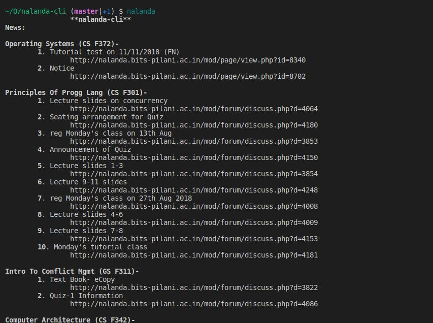
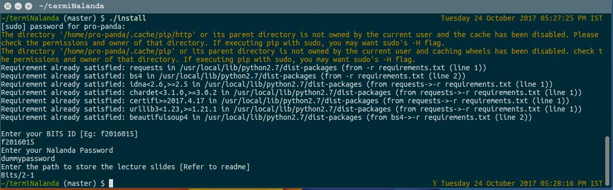

# nalanda-cli
Access nalanda from your terminal.<br>

<br>

## Requirements:
 - Ubuntu 16.04 or later
 - Python2.7
 - pip

## Installation:
 - Clone the repository. Open it a terminal and run install: <br>
```shell
./install 
```
 -  Inputs:
    1. Enter your BITS ID -<br>
Eg: if your ID is 2016A7PS0015P, type in
    ```shell
    f2016015
    ```
    2. Enter your nalanda password.

<br>

## Usage:
To see Nalanda updates or download the slides, open a terminal and type:
```shell
nalanda
```
