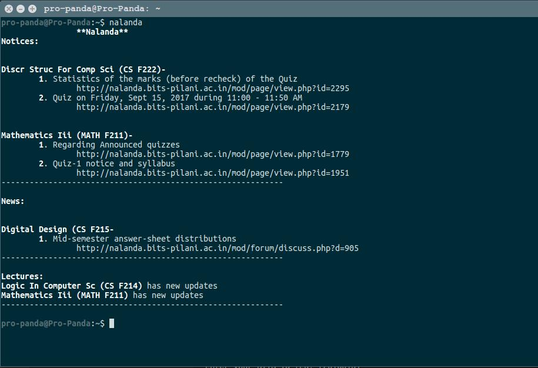

## Termi-Nalanda
### About:
It uses **bs4** and **requests** Libraries. It is used to access Nalanda - The E-Learning Management System for BITS Pilani, directly from the terminal<br>. It displays notices which you **haven't seen earlier** using this.<br>It will also **download/update** the lecture slides and other resources for you.<br>

### Requirements:
 - Ubuntu
 - Python2.7 or higher
 - pip
<br>

### Installation:
Clone the repository. Open it in a terminal and type: <br>
```shell
./install 
```
#### Inputs:
1. Enter your BITS ID -<br>
Eg: if your ID is 2016A7PS0015P, type in<br>
```shell
f2016015
```
2. Enter your nalanda password.
3. Enter the path to store lecture slides -<br>
Eg: If you want to store lecture slides at
```shell
/home/username/Bits/2-1/
```
then type,
```shell
Bits/2-1
```
### Usage:
Whenever, you want to see the Nalanda Updates or just download the slides, open a terminal and type:
```shell
nalanda
```

### Screenshots:
1. Installation
<br>
2. Using termi-nalanda
<br>
<br>

### License:
GPL
