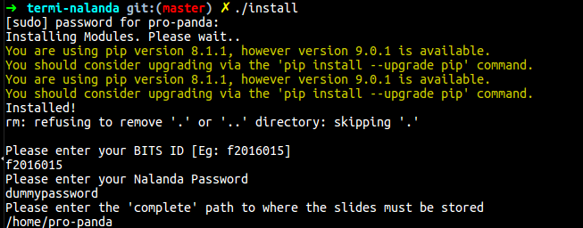
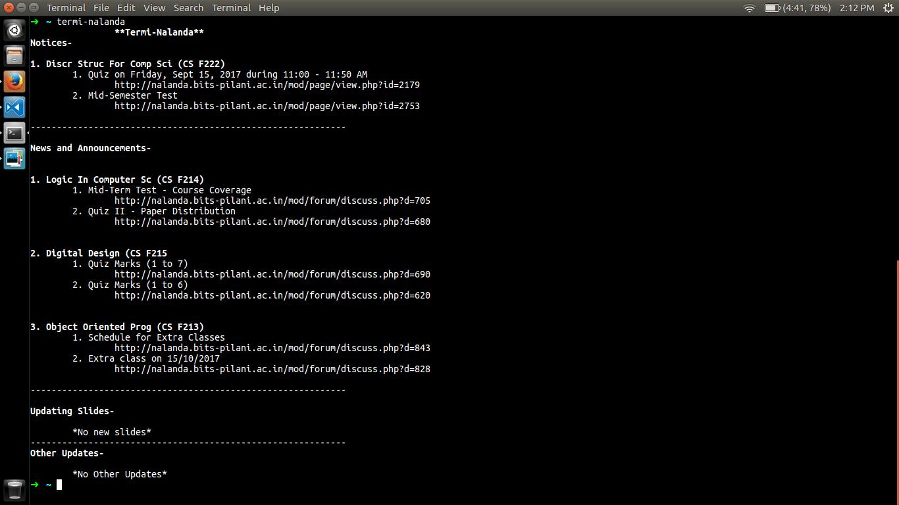

## Termi-Nalanda
#### About:
It uses **bs4** and **requests** Libraries. It scrapes Nalanda - The E-Learning Management System for BITS Pilani.<br>It is used to access nalanda using the terminal. It can show you notices, news and announcements which you **haven't seen earlier** using Termi-Nalanda.<br>It will also **download/update all** the lecture slides and other resources for you.<br>
#### Requirements:
Ubuntu, Python2.7 and pip installed
<br>
#### Usage:
Download the repository. Open it in a terminal and type: <br>
```shell
./install 
```
<br>
Whenever, you want to see the Nalanda Updates or just download the slides, type:
```shell
termi-nalanda
```
<br>
<br>
#### License:
GNU GPL
