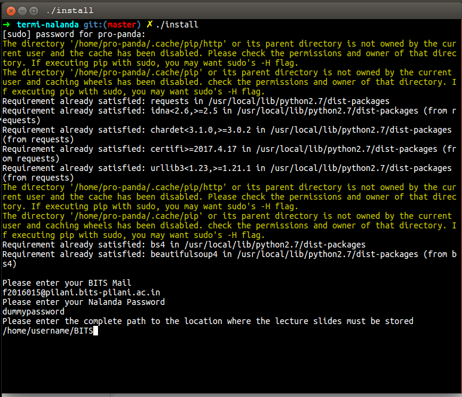
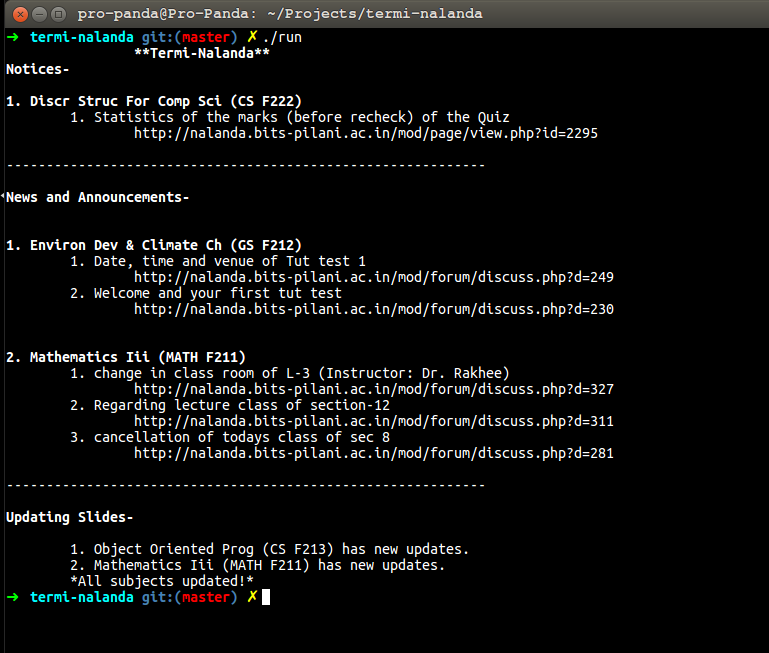

## Termi-Nalanda
#### About:
It uses **bs4** and **requests** Libraries. It scrapes Nalanda - The E-Learning Management System for BITS Pilani.<br>It is used to access nalanda using the terminal. It can show you notices, news and announcements which you **haven't seen earlier** using Termi-Nalanda.<br>It will also **download/update all** the lecture slides and other content for you.<br>
#### Requirements:
Ubuntu, Python2.7 and pip installed
<br>
#### Usage:
Download the repository. Open a terminal and type(only for the first time): <br>
```shell
./install 
```

Now whenever you want to start termiNalanda, type:
```shell
termi-nalanda
```

Each time you want to see if there are any new notices or announcements, or you want to download the new lecture slides
<br>
#### License:
GNU GPL

